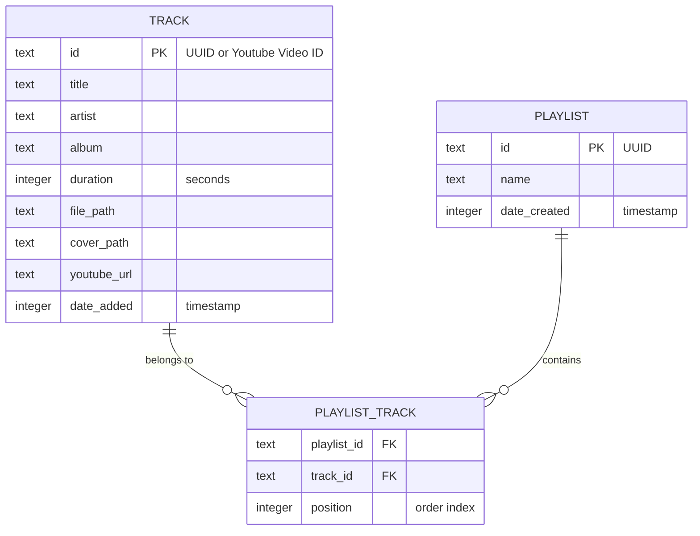

# Technical Architecture Document
**Filename:** `02-Technical-Architecture.md`
**Product:** BeatDrop — Offline Music Player & Downloader

---

## 1. Architecture Overview

### High-Level System Design (Phase 1 & Phase 2)

```mermaid
graph TD
    subgraph Windows Tauri App (Phase 1)
        UI[React + Tailwind CSS Frontend] <-->|Tauri IPC Commands| Core[Rust Core Backend]
        Core <-->|Query / Write| DB[(SQLite Database)]
        Core -->|Spawns Sidecar| YTDLP[yt-dlp Binary]
        Core -->|Reads/Writes| Storage[Local Music Directory]
    end

    subgraph Mobile Flutter App (Phase 2)
        FlutterUI[Flutter UI] <-->|Audio Engine| MobilePlayer[Audioplayers/Just_Audio]
        FlutterUI <-->|SQLite / Isar| MobileDB[(Mobile DB)]
    end

    Core <-->|P2P Network Sync (WiFi)| FlutterUI
```

### Key Architectural Decisions
1. **Tauri for Desktop:** Rust core provides safety, high speed, and a tiny binary footprint. The frontend runs in a native WebView, allowing us to build the UI with Tailwind CSS and React/Vite.
2. **Local P2P Sync (Phase 2):** To avoid cloud storage fees, sync is done directly over local WiFi. The Tauri app starts an ephemeral server, and the Flutter app connects to download audio files and synchronize SQLite metadata.
3. **yt-dlp as a Sidecar:** Using `yt-dlp` directly as a Tauri sidecar ensures extraction logic stays up to date. The Rust core controls executing command lines and streams download percentages back to the React UI via Tauri events.

---

## 2. Tech Stack Specification

### Windows Desktop App (Tauri)
* **Frontend Framework:** React 19 (via Vite)
* **Styling:** Tailwind CSS v4
* **Language:** TypeScript (strict mode)
* **Build tool:** Vite
* **Tauri version:** Tauri v2
* **Desktop Audio Player:** Tauri fs API / browser audio element or Rust `rodio` library [ASSUMED: Browser `<audio>` element with custom control bindings via Tauri local file protocol is used for simplicity and performance].
* **Downloader helper:** `yt-dlp` executable bundled as a Tauri sidecar.

### Mobile App (Flutter)
* **Framework:** Flutter (Dart)
* **Local Storage:** SQLite (via `sqflite` or `drift`) or `isar` database.
* **Audio Engine:** `just_audio` + `audio_service` (for background playback support on iOS/Android).

### Backend / Utility
* **Language:** Rust (Tauri Core commands, file management, sidecar executions).
* **Database:** SQLite (managed via Rust `rusqlite` or Tauri-plugin-sql).

---

## 3. Project Structure

### Windows App Directory Structure
```
music-player/
├── src-tauri/                 # Rust core backend
│   ├── src/
│   │   ├── main.rs            # Entry point, sets up Tauri builder & handlers
│   │   ├── commands/          # Rust command implementations (download, library)
│   │   │   ├── mod.rs
│   │   │   ├── downloader.rs  # Sidecar yt-dlp execution
│   │   │   └── player.rs      # Local file systems & scan operations
│   │   └── database.rs        # Local SQLite connector
│   ├── Cargo.toml             # Rust dependencies
│   ├── tauri.conf.json        # Tauri desktop config & sidecar mappings
│   └── bin/                   # Contains target yt-dlp executables (sidecars)
├── src/                       # Frontend source
│   ├── components/            # UI components (PlayerBar, LibraryGrid, Sidebar)
│   ├── hooks/                 # Custom React hooks (useAudioPlayer)
│   ├── store/                 # Zustand store (playbackState, downloadsState)
│   ├── index.css              # Global styling / Tailwind system
│   ├── App.tsx                # Main UI shell
│   └── main.tsx               # App mount point
├── package.json
└── tailwind.config.js
```

---

## 4. Data Architecture

### Entity Relationship Model (SQLite)
BeatDrop manages two main tables in SQLite.



---

## 5. API Design (Tauri IPC Commands)

Tauri uses JSON-RPC based IPC commands invoked via `invoke("command_name", { args })` from the React frontend.

### Endpoints (IPC Commands)

#### 1. `download_youtube_song` (Phase 1)
* **Arguments:** `url: string`
* **Response:** Streams progress via Tauri custom events (`download-progress`) with payload:
  ```typescript
  type DownloadProgressPayload = {
    url: string;
    progress: number; // 0 to 100
    status: 'fetching' | 'downloading' | 'converting' | 'completed' | 'failed';
    error?: string;
  }
  ```

#### 2. `get_library_tracks` (Phase 1)
* **Arguments:** None
* **Returns:** `Track[]`
  ```typescript
  type Track = {
    id: string;
    title: string;
    artist: string;
    album: string;
    duration: number;
    filePath: string;
    coverPath: string;
    youtubeUrl: string;
    dateAdded: number;
  }
  ```

#### 3. `create_playlist` (Phase 1)
* **Arguments:** `name: string`
* **Returns:** `Playlist`

#### 4. `add_track_to_playlist` (Phase 1)
* **Arguments:** `playlistId: string, trackId: string`
* **Returns:** `void`

---

## 6. P2P Local Network Sync Protocol (Phase 2)
1. **Discovery:** Windows Tauri app launches an ephemeral HTTP server on a random open port (e.g., `:8080`) and displays a QR code containing `http://<local-ip>:<port>`.
2. **Connection:** Mobile Flutter app scans the QR code or types the IP address.
3. **Synchronization:**
   * Flutter sends a requests to `GET /sync/manifest`.
   * Returns list of track IDs + hashes.
   * Flutter compares with local files, and requests missing files via `GET /sync/track/:id`.
   * Tauri streams the audio file binaries over TCP.
